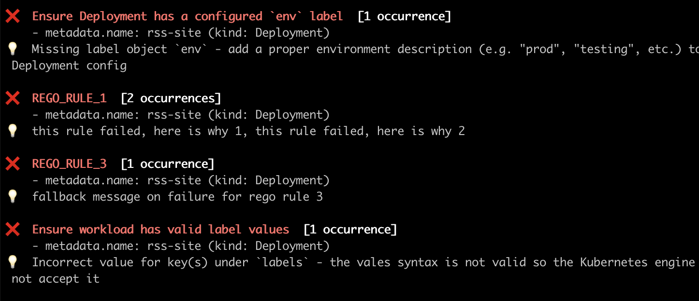

# This is a PoC/Demo for [Rego](https://www.openpolicyagent.org/docs/latest/policy-language/#what-is-rego) support in Datree.


## To run the demo:

```bash
git checkout add_rego_support
make run-rego-demo
```

## Specs:

- user should supply a glob pattern for its Rego files, inside PaC config.
- user should supply the PaC config **only** via the `--policy-config` flag.
- user should add the Rego rules to the policy rules array, along side `isRegoRule: true`.
  rules that are not explicitly added to the policy will be ignored
- user should export the Rego errors only in `package main` by pushing to the `deny` array (similar
  to [Conftest](https://www.conftest.dev/))
- deny errors should be of this type:

```typescript
interface DenyError {
    ruleID: string,
    message?: string,
}
```

- if a ruleID appears multiple times, the messages are concatenated
  and the number of occurrences is taken into account
- if a rule fails with no message, the messageOnFailure from PaC is used as a fallback
- is the `deny` array is empty, the test passes.

### policies.yaml

```yaml
regoRules: ./path-to-rego-rules/**.rego
policies:
  - policyWithRegoRules
    rules:
        - identifier: THIS_IS_THE_RULE_ID_1
          messageOnFailure: fallback message on failure for rule 1
          isRegoRule: true
```

### main.rego

```rego
package main

deny[error] {
    input.kind == "Deployment"
    error := { "ruleID": "REGO_RULE_1", "message":"message on failure, optional" }
}
```



## Resources:

- /pkg/rego - most of the implementation
- /internal/fixtures/regoDemo - the files needed for the demo

## Stuff still left to implement:

1. support rego with publish (not just with `--policy-config` flag)
2. validate the rego configuration on publish
3. support skip
4. error handling for execution errors (a lot of work!)
5. think of more edge cases (technical/product)
6. Refactors, cleanups, testing
